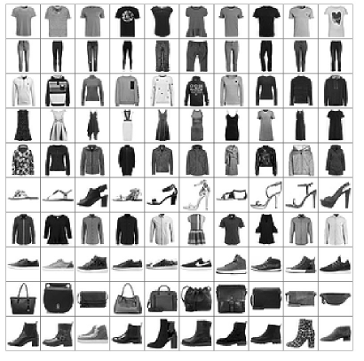
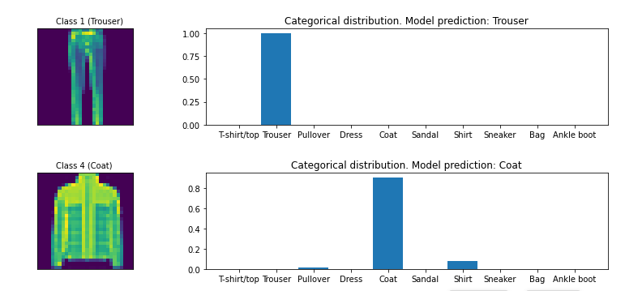

## Construct a ResNet model that classifies images of fashion items into one of 10 classes.(Using Tensorflow 2)

Data provided by : https://github.com/zalandoresearch/fashion-mnist

In this assignment, you will use the [Fashion-MNIST dataset](https://github.com/zalandoresearch/fashion-mnist). It consists of a training set of 60,000 images of fashion items with corresponding labels, and a test set of 10,000 images. The images have been normalised and centred. The dataset is frequently used in machine learning research, especially as a drop-in replacement for the MNIST dataset. 

- H. Xiao, K. Rasul, and R. Vollgraf. "Fashion-MNIST: a Novel Image Dataset for Benchmarking Machine Learning Algorithms." arXiv:1708.07747, August 2017.

Your goal is to construct a ResNet model that classifies images of fashion items into one of 10 classes.

#### model performance on the test dataset
Test loss: 0.471

Test accuracy: 83.470%

#### Predicted Output

